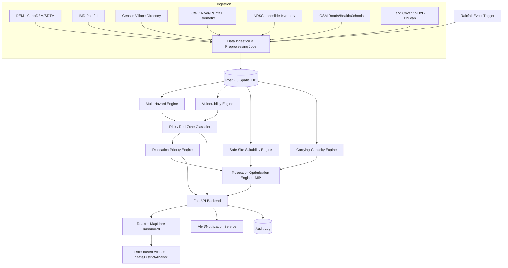
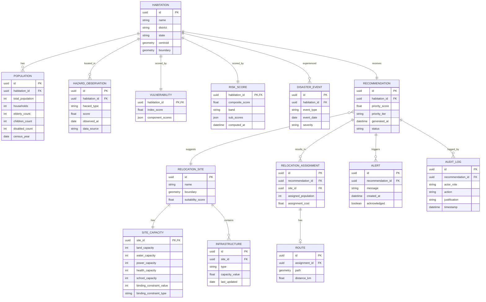

# Product Requirements Document
## Intelligent Multi-Hazard Red-Zone, Carrying-Capacity & Relocation Decision-Support Platform
**Problem Statement 26191 — NDRF (DM Division), Ministry of Home Affairs**

> Part B of two. Read `01-Strategic-Analysis.md` for the reasoning behind these decisions.

---

## 1. Executive Summary

A GIS-enabled decision-support platform that identifies multi-hazard red zones at habitation level, scores population vulnerability, produces a transparent relocation-priority ranking, evaluates candidate relocation sites (including their real carrying capacity), and computes an optimal village-to-site allocation — with every number traceable to its inputs and every recommendation requiring human approval. Not an autonomous system: a defensible, explainable evidence engine for State/District Disaster Management Authorities.

## 2. Problem Statement (recap)

India's disaster-prone regions face recurring landslides, floods, coastal erosion, and cloudbursts; relocation of vulnerable habitations is currently reactive. The platform must dynamically identify/update red zones, assess relocation-site carrying capacity, and prioritize habitations for immediate/short-term/medium-term relocation, integrating hazard intensity, population vulnerability, and disaster history.

## 3. Problem Analysis

See `01-Strategic-Analysis.md` §1. Summary: the real deliverable is an auditable answer to "who is at risk, how badly, how urgently, where can they go, can that place take them, and why" — not a hazard map.

## 4. Product Vision

*"The system a District Collector opens before monsoon season to know, with evidence, which three villages need to move first — and where."*

## 5. Goals

- G1: Produce a habitation-level, multi-hazard, continuously-updatable red-zone classification.
- G2: Produce a transparent, formula-driven relocation-priority ranking.
- G3: Identify and score candidate relocation sites, including a defensible carrying-capacity number.
- G4: Compute an optimal village→site allocation under capacity constraints.
- G5: Make every output explainable and require human approval before any downstream action.
- G6: Demonstrate live dynamic re-scoring in response to a new hazard event.

## 6. Non-Goals

- NG1: The system does not issue legal red-zone notifications — that remains a state government act.
- NG2: The system does not autonomously trigger evacuation or relocation.
- NG3: The system does not model individual-level population data (no PII beyond village-aggregate statistics).
- NG4: The hackathon build does not integrate live production IMD/CWC APIs (historical replay is used instead — see §20).
- NG5: The system does not attempt national-scale coverage in the MVP — one demo district (or a small multi-district set) is sufficient.

## 7. Target Users & Personas

| Persona | Role | Needs |
|---|---|---|
| **Meena, District Disaster Management Officer** | Operational decision-maker | Ranked list of villages needing relocation this season, with evidence she can present to her Collector |
| **Rajan, State DMA Planner** | Budget/policy owner | Cross-district comparison, site-capacity planning, multi-year roadmap |
| **NDRF Response Team Lead** | Field responder | Real-time alerts when a village's tier changes, routes for evacuation support |
| **GIS/Data Analyst (govt technical cell)** | Data steward | Ability to update layers, adjust weights, audit data provenance |

## 8. User Journeys

**Journey A — Seasonal Planning (Meena):** Opens dashboard → filters to her district → reviews priority-ranked village list → clicks top village → reviews evidence breakdown → reviews recommended site + capacity → approves or requests re-evaluation → exports report for her Collector.

**Journey B — Live Event Response (NDRF Lead):** Receives alert that a rainfall event has pushed 3 villages into "Immediate" tier → opens map → reviews updated hazard layers and affected population → checks recommended evacuation routes → dispatches team.

**Journey C — Data Governance (GIS Analyst):** Logs in → reviews data-freshness indicators → flags a stale Census entry → uploads a corrected local survey figure → triggers recompute → reviews audit log of the change.

## 9. Functional Requirements

Numbered, MUST/SHOULD/MAY, testable.

**Hazard & Risk**
- FR-1 (MUST): The system shall compute a per-habitation landslide susceptibility score (0–1) using slope, aspect, elevation, terrain wetness index, rainfall, land cover, and distance-to-road-cut features, via a trained classifier, and shall display the top-3 contributing features with the score.
- FR-2 (MUST): The system shall compute a per-habitation flood hazard score (0–1) using a DEM-derived HAND (Height Above Nearest Drainage) value combined with rainfall accumulation.
- FR-3 (SHOULD): The system shall compute a coastal-erosion score for habitations within 5km of a coastline using historical shoreline-change data where available.
- FR-4 (MUST): The system shall combine per-hazard scores into a composite Risk Index using the max-rule-plus-residual formula (`01-Strategic-Analysis.md` §5), normalized 0–100, and shall classify each habitation into one of four bands: Green, Watch, Orange, Red.
- FR-5 (MUST): The composite Risk Index display shall always show the contributing per-hazard sub-scores alongside the composite.

**Vulnerability**
- FR-6 (MUST): The system shall compute a per-habitation Vulnerability Index (0–1) from population density, % elderly, % children, % disabled, housing-quality proxy, distance to health facility, distance to all-weather road, and historical disaster count, using a documented, adjustable weighted formula.
- FR-7 (MUST): The system shall visibly distinguish Hazard, Exposure (population count), Vulnerability, and Risk as separate displayed values — never merge them into a single unlabelled number.

**Relocation Priority**
- FR-8 (MUST): The system shall compute a Relocation Priority Score (0–1) as a named weighted sum of Hazard Severity, Population Exposed, Vulnerability Index, Historical Disaster Frequency, and Safe-Site Availability, and classify each habitation into Immediate / Short-term / Medium-term / Monitor tiers per documented thresholds.
- FR-9 (MUST): Clicking any habitation shall display the full score breakdown (each weighted term with its value) in plain language, answering "why this rank."

**Site Suitability & Capacity**
- FR-10 (MUST): The system shall exclude, from candidate site consideration, any location inside a hazard red zone, a notified protected/eco-sensitive area, or already-occupied revenue land.
- FR-11 (MUST): The system shall score remaining candidate sites on a Suitability Score (0–1) using safety, infrastructure-access, socioeconomic, and environmental sub-scores.
- FR-12 (MUST): The system shall compute each candidate site's Carrying Capacity as the minimum across land, water, power, health, and school constraint-derived population limits, and shall display which constraint is binding.
- FR-13 (SHOULD): The system shall apply a configurable safety margin (default 0.85) to the binding-constraint capacity figure.

**Optimization**
- FR-14 (MUST): Given a set of priority villages and candidate sites with capacities, the system shall compute a village→site assignment that minimizes a weighted cost function (distance, safety, infrastructure cost, livelihood disruption) subject to capacity constraints, using an exact MIP or min-cost-flow solver.
- FR-15 (MUST): If no feasible assignment exists for a village within configured distance/capacity bounds, the system shall flag that village as "Escalate — no feasible site found" rather than force an infeasible or silently-dropped assignment.
- FR-16 (SHOULD): The system shall display the recommended assignment with a route (shortest/safest path) between village and site.

**Explainability, Governance & Human-in-the-Loop**
- FR-17 (MUST): Every score and recommendation surfaced to a user shall display the data vintage (e.g., "Population data: Census 2011") and a confidence/data-completeness indicator.
- FR-18 (MUST): No relocation recommendation shall be marked "actioned" without an explicit, logged human approval action (Approve / Override-with-reason / Request more data).
- FR-19 (MUST): All approvals, overrides, and manual data corrections shall be recorded in an append-only audit log, viewable by role.
- FR-20 (SHOULD): Role-based views shall exist for at least State, District, and GIS-Analyst roles, each seeing only their scope of data.

**Real-Time / Dynamic Update**
- FR-21 (MUST): The system shall support triggering a recomputation of hazard/risk/priority scores for a district in response to a new rainfall/event input, and shall visibly update affected habitations' scores and tiers without requiring a full page/app reload.
- FR-22 (SHOULD): The system shall generate a visible alert when a habitation's tier changes as a result of a recomputation.

## 10. Non-Functional Requirements

- NFR-1 (MUST): Recomputation of a single district's scores (≤50 habitations) shall complete in under 10 seconds in the demo environment.
- NFR-2 (MUST): All formulas and model feature importances used to produce a displayed score shall be inspectable from the UI (no hidden weights).
- NFR-3 (MUST): The system shall never display a relocation recommendation without its corresponding data-vintage/confidence indicator (ties to FR-17).
- NFR-4 (SHOULD): The map UI shall remain responsive (interactions <500ms) with at least 500 habitation points and 5 raster layers loaded.
- NFR-5 (MUST): No individual-level personal data shall be stored; only village/habitation-aggregate statistics.
- NFR-6 (SHOULD): The codebase shall separate the scoring/optimization logic (pure functions, testable independently) from the API and UI layers, so formulas can be unit-tested against the worked examples in the Strategic Analysis.

## 11. Core Features (Engines)

1. **Multi-Hazard Engine** — per-hazard scoring + composite Risk Index (FR-1–5)
2. **Vulnerability Engine** — Vulnerability Index (FR-6–7)
3. **Relocation Priority Engine** — Priority Score + tiering (FR-8–9)
4. **Safe-Site Suitability Engine** — filtering + scoring (FR-10–11)
5. **Carrying-Capacity Engine** — bottleneck-based capacity (FR-12–13)
6. **Relocation Optimization Engine** — MIP/min-cost-flow allocation (FR-14–16)
7. **Real-Time Update Engine** — event-triggered recompute (FR-21–22)
8. **Explainability & Governance Layer** — cross-cutting (FR-17–20)

## 12. AI/ML Components

See `01-Strategic-Analysis.md` §12 for the full spec table. Summary: Random Forest/XGBoost for landslide susceptibility (real signal, real label source, explainable via feature importance); everything else is deterministic by design decision, not by omission.

## 13. Data Architecture

Sources, resolutions, and access notes: see `01-Strategic-Analysis.md` §13. Ingestion pattern for the hackathon: batch-download once per data source into a local PostGIS instance / flat GeoTIFFs and CSVs; no live external API dependency in the demo path (real-time behavior is simulated via a "replay historical event" control — see §20).

## 14. GIS Architecture

- Spatial database: **PostGIS** (Postgres + spatial extension) for vector data (habitations, sites, admin boundaries, roads).
- Raster processing: **Rasterio + GDAL** for DEM derivatives (slope, aspect, HAND, TWI); precompute once, store as GeoTIFF, serve tiles.
- Vector processing: **GeoPandas** for zonal statistics (raster→habitation aggregation) and spatial joins.
- Serving: pre-tiled raster layers (e.g. via `titiler` or simple static tile generation) + vector GeoJSON for habitations/sites, consumed by a web map (Leaflet or MapLibre GL JS).

## 15. System Architecture (Mermaid)

## 16. Database Design (Mermaid ER)

## 17. User Roles & Workflows

| Role | Sees | Can do | Decides | Needs |
|---|---|---|---|---|
| State DMA | All districts in state, cross-district comparison | Approve/override recommendations, adjust state-level weights | Budget allocation across districts | Comparative dashboard, exportable reports |
| District DMA | Own district only | Approve/override, request re-evaluation | Which villages move first | Ranked list, evidence breakdown, route plans |
| Local Administration | Own block/tehsil | View, add local corrections (e.g. updated population) | N/A (advisory input) | Simple correction form |
| NDRF/Response Teams | Live alerts, routes | Acknowledge alerts, dispatch | Field response sequencing | Real-time tier-change alerts, routes |
| GIS/Data Analyst | Raw layers, data provenance | Update datasets, adjust default weights, trigger recompute | Data quality | Audit log, upload interface |
| Government Planner | Multi-year view | Scenario comparison (stretch) | Long-term infrastructure investment | Capacity-bottleneck reports |

## 18. UX / UI Specification

**Main map**: layered toggle for Multi-hazard risk, Red zones (banded), Vulnerability, Population density, Disaster history markers, Relocation sites, Infrastructure points, Recommended routes.

**Side panel (on habitation click)**: Risk score + hazard breakdown; Vulnerability score; Population exposed (with demographic split); Relocation priority tier + full formula breakdown; recommended site(s) with suitability + capacity + binding constraint; "Evidence" tab showing data sources and vintages; Approve / Override / Request-more-data buttons.

**Relocation planner view**: table — Village → Population → Priority Tier → Recommended Site → Capacity (binding constraint shown) → Distance → Site Safety → Assignment Cost → Reason (auto-generated one-line explanation). This table is the direct deliverable a District officer would print/export for a committee meeting.

**Design principle**: every screen is built around "what does an official need to decide next," not around showing more data — a screen that adds a layer without changing a decision doesn't ship.

## 19. Explainability

Implementation approach: (1) formula-based scores expose every weighted term by construction (§9 FR-5, FR-9, FR-13); (2) the one ML model (landslide susceptibility) surfaces scikit-learn feature importances by default, with SHAP as a stretch goal if time permits; (3) the optimizer's solution is accompanied by its cost breakdown per assignment and, on infeasibility, an explicit reason.

## 20. Security, Privacy, Model Governance (hackathon-proportional)

Hackathon: mocked login with 3 role types, no real citizen PII (village-aggregate data only), append-only audit log (§16 AUDIT_LOG table) covering approvals/overrides/data-corrections, all defaults and weights stored as versioned config (not hardcoded) so a change is traceable. Production trajectory (documented, deferred): government SSO/RBAC integration, encryption at rest/in transit, formal MoUs for NRSC/IMD/CWC data access, model version registry with drift monitoring, backup/DR aligned to NIC/MeghRaj government cloud standards.

## 21. Validation Strategy

See `01-Strategic-Analysis.md` §21 for the full table (precision/recall/F1/AUC for hazard classification, IoU for flood extent, rank-correlation face validity for priority, weight-sensitivity analysis for suitability, planning-norm sanity checks for capacity, optimality gap for allocation).

## 22. MVP Scope

Must/Should/Could/Won't as defined in `01-Strategic-Analysis.md` §14 — copy verbatim into the team's task tracker before sprint planning.

## 23. Future Scope

Multi-district and eventually national rollout; live IMD/CWC API integration; satellite change-detection layer for encroachment/erosion monitoring; GNN-based drainage-network flood routing (once a real production data pipeline exists); mobile app for field data correction by local officials; formal integration with State/District e-governance systems for approval workflows.

## 24. Technical Roadmap (post-hackathon, indicative)

Phase 1 (0–3 months): harden data pipelines, formal data-sharing agreements, pilot in 1 state/2 districts. Phase 2 (3–9 months): live real-time ingestion, RBAC/SSO integration, multi-district scaling. Phase 3 (9–18 months): satellite change-detection, drainage-network flood modelling, national rollout planning with NDMA/SDMA.

## 25. Hackathon Development Plan & Team Division

Suggested for a 4–6 person team; adjust to actual team size and skills.

| Role | Responsibility | Suggested owner profile |
|---|---|---|
| GIS/Data engineer | DEM processing, hazard raster derivation, PostGIS setup, dataset ingestion | Comfortable with GeoPandas/Rasterio |
| ML engineer | Landslide susceptibility model, feature engineering, evaluation | Comfortable with scikit-learn/XGBoost (matches prior classifier-pipeline experience) |
| Backend/optimization developer | FastAPI, scoring-engine formulas, PuLP/OR-Tools allocation, API contracts | Python backend |
| Frontend/map developer | React + MapLibre/Leaflet dashboard, side panel, relocation planner table | React (existing familiarity from prior hackathon work transfers directly) |
| Integration/demo lead | Wires the "inject rainfall event" live-recompute demo path, seeds realistic demo data, owns the pitch | Whoever is most comfortable narrating live |
| (If 6th member) Data/QA | Validates formulas against worked examples, prepares the validation slide, proofs the PRD-to-build mapping | — |

**Development order** (24–48h): (1) Data ingestion + DB schema, (2) DEM-derived hazard layers + composite Risk Index, (3) Vulnerability Index, (4) Priority Engine, (5) Site suitability + Carrying Capacity, (6) Optimization allocation, (7) Frontend map + side panel, (8) live-recompute demo path, (9) polish + rehearse.

## 26. Demo Scenario (script)

See `01-Strategic-Analysis.md` §15 for the full beat-by-beat script (baseline dashboard → inject rainfall event → live tier change → click habitation for explainable breakdown → run optimizer → show route → show human-approval step).

## 27. Success Metrics (for the hackathon submission itself)

- Full pipeline (hazard→risk→vulnerability→priority→site→capacity→allocation) demonstrably connected end to end, not siloed screens.
- At least one live, on-stage recomputation triggered by a simulated event.
- At least one score whose full arithmetic a judge can verify on the spot from the displayed breakdown.
- Optimizer produces a provably-optimal (solver-confirmed) allocation with a shown infeasibility-handling case.

## 28. Risks & Mitigations

| Risk | Mitigation |
|---|---|
| Real-time govt APIs (IMD/Bhoonidhi) unavailable in time | Historical-event replay built as the primary demo path from day 1, not a fallback bolted on later |
| Landslide inventory too sparse for the chosen demo district | Pick the demo district using NRSC's published hotspot list (e.g. known high-density districts) so training signal exists |
| Census data staleness undermines credibility | Surface data-vintage prominently as a feature (transparency), not hide it |
| Team unfamiliar with GIS raster tooling under time pressure | Precompute heavy raster derivatives (slope/HAND) once, cache results, keep the live demo path light |
| Optimizer edge cases (infeasibility) not handled, breaks live demo | Explicitly build and rehearse the infeasible-case UI (§9 FR-15) before demo day |

## 29. Competitive Differentiation

See `01-Strategic-Analysis.md` §24.

## 30. Judge Evaluation

See `01-Strategic-Analysis.md` §25 for scores and rejection-risk mitigations — review this section as a team the night before the demo.

## 31. Deployment Architecture (hackathon)

Single-VM or containerized deployment: PostGIS (Docker), FastAPI backend, precomputed raster/vector data volumes, React static build served via Nginx or a simple Node server, all on one cloud VM (or entirely local if venue internet is unreliable — this is a real hackathon-day risk worth planning for).

---

# IF WE ONLY HAVE 24–48 HOURS

**Build exactly this:**
1. One real demo district's habitation points + boundaries (from open community shapefiles or digitized manually from Census village lists — a few dozen villages is enough).
2. DEM-derived slope/HAND for that district (SRTM 30m via OpenTopography — fastest path, skip CartoDEM registration under time pressure).
3. A landslide-susceptibility Random Forest trained on whatever labelled points are obtainable for that district (or a clearly-labelled synthetic training set built from documented terrain thresholds if a real inventory isn't reachable in time — disclose this in the demo).
4. Composite Risk Index, Vulnerability Index (from a downloaded Census Village Directory extract), Priority Score — all as plain Python functions, unit-tested against the worked examples.
5. 3–5 candidate relocation sites with hand-curated capacity inputs (land/water/power/health/school) — real numbers for a real district if findable, clearly-labelled reasonable estimates otherwise.
6. A PuLP MIP solving the allocation, including one deliberately infeasible village to demo the escalation path.
7. React + MapLibre map with the side panel and relocation-planner table.
8. One scripted "inject a historical extreme-rainfall day" button that re-runs steps 3–6 and visibly changes tiers.

**Fake/mock, and say so on stage:** live IMD/CWC API feeds (replay historical data instead); full RBAC/SSO (three mocked logins); any national-scale claim (stay explicitly single-district).

**Defer:** satellite change detection, SHAP explainability (feature importances are enough), route optimization beyond straight-line/road-network distance, coastal-erosion module unless the chosen district is coastal.

**Suggested datasets** (all real, all cited): SRTM 30m DEM (OpenTopography/USGS EarthExplorer); IMD 0.25° gridded rainfall (IMDLIB) or a CWC telemetry rainfall extract for one flood event; NRSC Landslide Atlas inventory points for the chosen district (Bhuvan); Census 2011 Village Directory/Primary Census Abstract (data.gov.in or the SHRUG dataset) for population and amenities; OpenStreetMap for roads/health/school points; community admin-boundary shapefiles (e.g. `datameet`) for village polygons.

**Team division**: as in §25 — GIS/data, ML, backend/optimization, frontend/map, integration/demo lead.

**Demo flow**: as in §26 / Strategic Analysis §15 — baseline → live event injection → explainable drill-down → optimizer run with a shown infeasible case → human-approval click. Rehearse this exact sequence at least twice before presenting.

**What NOT to waste time building**: a custom auth system, a general-purpose CMS for uploading arbitrary layers, a mobile app, any deep-learning imagery model, multi-state scaling — none of these change whether the judges believe the core loop works.

---

## Recommended Final Tech Stack

| Layer | Choice | Why |
|---|---|---|
| Frontend | **React + MapLibre GL JS (or Leaflet) + Tailwind** | Directly reuses existing React project experience; MapLibre is free/open (no API-key friction under time pressure) |
| Backend | **FastAPI (Python)** | Same language as the ML/GIS stack, minimal context-switching, async-friendly for the recompute-trigger endpoint |
| GIS database | **PostgreSQL + PostGIS** | Standard, well-documented, handles both vector habitation/site data and spatial queries needed for suitability filtering |
| Raster processing | **Rasterio, GDAL, GeoPandas, numpy** | Standard Python geospatial stack; matches existing Python fluency |
| ML | **scikit-learn (RandomForest) / XGBoost** | Directly matches prior classifier-pipeline experience (GridSearchCV-style workflow); explainable via feature importances out of the box |
| Optimization | **PuLP (CBC solver) or Google OR-Tools** | Free, fast for hackathon-scale MIPs, well-documented Python APIs |
| Routing (stretch) | **OSRM (self-hosted) or simple networkx shortest-path on OSM road graph** | Avoids paid routing API dependency |
| Rapid internal tooling (optional) | **Streamlit** for an analyst-facing data-correction/admin view if time is very short | Fastest possible path to a working internal screen, reusing existing Streamlit familiarity — reserve the polished React app for the judge-facing demo |
| Hosting | Single Docker-composed VM (Postgres+PostGIS, FastAPI, static React build via Nginx) | Minimizes moving parts and network dependency risk on demo day |
