# System Implementation Plan

**System Name:** AASHRAYA-GIS (Intelligent Multi-Hazard Red-Zone, Carrying-Capacity & Relocation Decision-Support Platform)  
**Problem Statement:** 26191 — NDRF (Disaster Management Division), Ministry of Home Affairs  
**Demo District:** Wayanad, Kerala (High-density multi-hazard terrain: historical landslides at Chooralmala/Meppadi/Puthumala + riverine flooding along Chaliyar basin)  

---

## 1. System Architecture

The application is structured as a high-performance **Modular Monolith** optimized for zero-network-dependency offline presentation and sub-second decision generation:

```mermaid
graph TD
    subgraph UI ["Frontend: Command Center UI (React 19 + TypeScript + Vite + Tailwind + Leaflet)"]
        DASH[1. Command Center Dashboard]
        MAP[2. Intelligent Multi-Hazard GIS Map]
        DRAWER[3. Explainable Habitation Detail Drawer]
        PLANNER[4. Carrying-Capacity Relocation Planner]
        ANALYTICS[5. Spatial Risk Analytics]
        METHOD[6. Mathematical Methodology Explorer]
        SIM_MODAL[7. Live Rainfall Injection Controller]
        AUDIT_LOG[8. Human Governance & Audit Log Modal]
    end

    subgraph API ["Backend: FastAPI Decision Services (Python 3.14)"]
        EP_CORE["/api/dashboard, /api/habitations, /api/hazards, /api/analytics"]
        EP_RELOC["/api/relocation/sites, /api/relocation/optimize, /api/relocation/approve"]
        EP_SIM["/api/simulation/heavy-rainfall, /api/simulation/reset"]
        EP_AUDIT["/api/audit/logs"]
    end

    subgraph ENGINES ["Analytical & Operations Research Engines"]
        ENG_HAZ["Hazard Engine: Terrain DEM (Slope, Elevation, HAND) + IMD Grid Replay"]
        ENG_ML["ML Susceptibility: Scikit-learn Classifier with Feature Importances"]
        ENG_VULN["Vulnerability Engine: Census Proxies (Demographics, Housing, Infra Distance)"]
        ENG_RISK["Risk Engine: Max-Rule-Plus-Residual Formulation & Tier Banding"]
        ENG_CAP["Capacity Engine: Multi-Factor Bottleneck Logic & Safety Margins"]
        ENG_OPT["Optimization Engine: Mixed-Integer Linear Programming (PuLP / MILP)"]
        ENG_SIM["Simulation Engine: Dynamic Recomputation & Alert Dispatcher"]
    end

    subgraph STORE ["Offline-Resilient Datastore & Spatial Seed"]
        VILLAGES["habitations.json: 24 Villages (Wayanad) with Census & Infra Metrics"]
        SITES["candidate_sites.json: 6 Resilient Sites with Land, Water, Power, Health, School Caps"]
        POLYGONS["hazard_zones.geojson: Data-driven Landslide, Flood, and Composite Red-Zones"]
        IN_MEM_STATE["State Store: Active Hazard Overrides, Allocations, and Audit Trail"]
    end

    UI --> API
    API --> ENGINES
    ENGINES --> STORE
```



---

## 2. Technology Choices & Rationale

| Layer | Chosen Technology | Engineering Rationale |
|:---|:---|:---|
| **Frontend Framework** | React 19 + Vite + TypeScript | Blazing-fast hot module replacement, rock-solid typing, zero build friction. |
| **Styling & UI Kit** | Tailwind CSS + Lucide Icons + Custom Military/Command Dark Theme | High-contrast, serious emergency command-center palette (Slate 950, Emerald, Amber, Crimson, Indigo). |
| **Interactive Mapping** | Leaflet + React-Leaflet + Canvas Tile Layer | Zero API key requirement, works 100% offline or with open standard tiles, instantaneous polygon & marker rendering. |
| **Data Analytics Charts** | Recharts | Responsive, clean SVG charts for capacity bottlenecks, vulnerability breakdowns, and hazard distributions. |
| **Backend Framework** | FastAPI (ASGI) + Pydantic v2 | High-performance asynchronous REST endpoints, automated OpenAPI specs, strict JSON validation. |
| **Mathematical Optimization** | PuLP (CBC Solver) + Scipy | Exact Mixed-Integer Linear Programming (MILP) guaranteeing provably optimal village-to-site assignments under hard capacity bottlenecks; detects and escalates infeasible assignments. |
| **Machine Learning** | Scikit-Learn (Random Forest) | Real trained classifier on documented terrain covariates (slope, elevation, TWI, rainfall) with inspectable feature importances. |
| **Geospatial Processing** | Shapely 2.1 + Turf-compatible GeoJSON | High-speed in-memory vector geometry operations (haversine distances, polygon containment, point buffering) without GDAL/C-compiler failure modes on Windows. |

---

## 3. Data Models & Schemas

### 3.1 Habitation (Village)
```json
{
  "id": "VIL_001",
  "name": "Chooralmala",
  "panchayat": "Meppadi",
  "district": "Wayanad",
  "coordinates": [11.5342, 76.1738],
  "population": 2850,
  "households": 640,
  "demographics": {
    "elderly_pct": 0.14,
    "children_pct": 0.18,
    "disabled_pct": 0.035,
    "kutcha_housing_pct": 0.42,
    "poverty_bpl_pct": 0.38
  },
  "infrastructure_distances_km": {
    "nearest_hospital": 14.5,
    "all_weather_road": 3.2,
    "police_fire_station": 12.0
  },
  "historical_disasters_10y": 4,
  "terrain": {
    "elevation_m": 880,
    "slope_deg": 34.5,
    "hand_m": 4.2,
    "twi": 8.1
  },
  "current_rainfall_24h_mm": 120.0
}
```

### 3.2 Candidate Relocation Site
```json
{
  "id": "SITE_001",
  "name": "Kalpetta South Relief Plateau",
  "panchayat": "Kalpetta",
  "coordinates": [11.6025, 76.0850],
  "usable_area_ha": 45.0,
  "existing_population": 1200,
  "capacities": {
    "land_capacity": 5625,
    "water_capacity": 3200,
    "power_capacity": 4500,
    "health_capacity": 3000,
    "school_capacity": 3500
  },
  "infra_access_score": 0.92,
  "site_safety_score": 0.95,
  "is_protected_eco_area": false,
  "is_inside_hazard_zone": false,
  "environmental_flag": 1.0
}
```

---

## 4. Mathematical Engine Specifications

### 4.1 Hazard & Susceptibility Engine (`hazard_engine.py` & `ml_susceptibility.py`)
- **Landslide Susceptibility ($H_{\text{landslide}}$):**
  Derived from Random Forest model trained on terrain features $(\text{slope}, \text{elevation}, \text{aspect}, \text{TWI}, \text{rainfall})$:
  $$H_{\text{landslide}} \in [0, 1]$$
- **Flood Hazard ($H_{\text{flood}}$):**
  Derived from Height Above Nearest Drainage (HAND) normalized inversely and modulated by antecedent 24h rainfall:
  $$H_{\text{flood}} = \min\left(1.0, \frac{\text{Rainfall}_{24\text{h}}}{250.0} \times \exp\left(-\frac{\text{HAND}}{5.0}\right)\right)$$
- **Cloudburst / Extreme Rain Hazard ($H_{\text{cloudburst}}$):**
  Threshold activation based on IMD severe thresholds:
  $$H_{\text{cloudburst}} = \begin{cases} 1.0 & \text{if Rainfall} \ge 100\text{ mm/hr or } \ge 200\text{ mm/24h} \\ \frac{\text{Rainfall}_{24\text{h}}}{200.0} & \text{otherwise} \end{cases}$$

### 4.2 Composite Risk Engine (`risk_engine.py`)
Uses the auditable **Max-Rule-Plus-Residual** formula (PRD §5):
$$\text{MaxHazard} = \max(w_1 H_{\text{landslide}}, w_2 H_{\text{flood}}, w_3 H_{\text{cloudburst}})$$
$$\text{HazardIndex} = \min\left(1.0, \text{MaxHazard} + \lambda \sum_{\text{other}} w_i H_i\right) \quad (\lambda = 0.15)$$
$$\text{CompositeRisk} = 100 \times \left(0.40 \times \text{HazardIndex} + 0.25 \times \text{Exposure} + 0.20 \times \text{Vulnerability} + 0.15 \times \text{History}\right)$$
- **Bands:**
  - **Red Zone (Immediate):** Risk $\ge 70$ OR any hazard subscore $\ge 0.85$
  - **Orange Zone (High):** $50 \le \text{Risk} < 70$
  - **Watch Zone (Medium):** $30 \le \text{Risk} < 50$
  - **Green Zone (Safe/Monitor):** $\text{Risk} < 30$

### 4.3 Vulnerability Engine (`vulnerability_engine.py`)
Deterministic, weighted linear combination of Census 2011/SHRUG indicators:
$$\text{VulnerabilityIndex} = \sum_{k} w_k \times I_k$$
Where indicators $I_k \in [0, 1]$ include % elderly, % children, % disabled, % kutcha houses, normalized hospital distance, and normalized road distance.

### 4.4 Relocation Priority Engine (`relocation_engine.py`)
$$\text{PriorityScore} = 0.35 \times \text{HazardIndex} + 0.25 \times \text{VulnerabilityIndex} + 0.20 \times \text{ExposureNorm} + 0.10 \times \text{HistoryNorm} + 0.10 \times (1 - \text{SafeSiteAvailability})$$
- **Tiers:**
  - **IMMEDIATE:** Priority $\ge 0.75$ OR any single hazard score $\ge 0.90$
  - **SHORT-TERM:** $0.50 \le \text{Priority} < 0.75$
  - **MEDIUM-TERM:** $0.30 \le \text{Priority} < 0.50$
  - **MONITOR:** $\text{Priority} < 0.30$

### 4.5 Carrying Capacity Engine (`capacity_engine.py`)
Bottleneck evaluation with mandatory safety margin $\eta = 0.85$ (PRD §9):
$$\text{LandCap} = \text{UsableArea}_{\text{ha}} \times 125 \text{ persons/ha}$$
$$\text{WaterCap} = \frac{\text{NetSupply}_{\text{LPD}}}{100 \text{ LPCD}}$$
$$\text{PowerCap} = \frac{\text{SubstationHeadroom}_{\text{kW}}}{0.5 \text{ kW/household}} \times 4.5 \text{ persons/household}$$
$$\text{HealthCap} = \text{PHCCapacity} - \text{CurrentCatchment}$$
$$\text{SchoolCap} = (\text{ClassroomHeadroom} \times 40) \times \text{DemographicMultiplier}$$
$$\text{EffectiveCapacity} = \lfloor \min(\text{LandCap}, \text{WaterCap}, \text{PowerCap}, \text{HealthCap}, \text{SchoolCap}) \times 0.85 \rfloor$$
Surfaces the exact **Binding Constraint** (e.g., "Water Infrastructure: 100 LPCD limit").

### 4.6 Optimization Engine (`optimization_engine.py`)
Mixed-Integer Linear Programming (MILP) solved via PuLP / CBC:
$$\min \sum_{i \in \text{Villages}} \sum_{j \in \text{Sites}} x_{ij} \cdot \left[ \alpha \cdot \frac{d_{ij}}{d_{\max}} + \beta \cdot (1 - S_j) + \gamma \cdot (1 - \text{Infra}_j) \right]$$
**Subject to:**
1. Each priority village assigned to at most 1 site:
   $$\sum_{j} x_{ij} \le 1 \quad \forall i$$
2. Site capacity cannot be exceeded:
   $$\sum_{i} \text{Pop}_i \cdot x_{ij} \le \text{AvailableCapacity}_j \quad \forall j$$
3. Distance bound: $d_{ij} \le 35\text{ km}$
4. Binary assignment: $x_{ij} \in \{0, 1\}$
5. **Infeasibility Handling:** If $\sum_j x_{ij} = 0$ for a village requiring relocation, flag status as **"ESCALATE — Insufficient Regional Capacity / No Feasible Safe Site"**.

---

## 5. API Design (`/backend/app/routes`)

| Route | Method | Description |
|---|---|---|
| `/api/dashboard` | `GET` | High-level summary KPI metrics, risk distributions, priority counts, capacity utilization. |
| `/api/habitations` | `GET` | List of all assessed habitations with scores, risk bands, coordinates, and priority tiers. |
| `/api/habitations/{id}` | `GET` | Granular detail of a specific village including plain-language explainability factor breakdown. |
| `/api/hazards/layers` | `GET` | GeoJSON polygons and contours for Landslide, Flood, and Composite Red-Zones. |
| `/api/relocation/sites` | `GET` | Candidate relocation sites with raw capacities, effective capacity, and binding constraints. |
| `/api/relocation/optimize` | `POST` | Executes MILP solver for selected habitations against candidate sites, returning optimal allocations and routes. |
| `/api/relocation/approve` | `POST` | Logs human-in-the-loop decision (Approve, Override, Request More Data) to audit trail. |
| `/api/simulation/heavy-rainfall` | `POST` | Injects simulated extreme rainfall event (e.g. +150mm), recomputing hazard/risk/priority pipeline dynamically. |
| `/api/simulation/reset` | `POST` | Resets conditions to baseline pre-monsoon state. |
| `/api/analytics` | `GET` | Recharts datasets for risk vs. population, capacity headroom by site, and hazard correlation. |
| `/api/audit/logs` | `GET` | Full append-only log of all operator approvals, overrides, and simulation triggers. |

---

## 6. Frontend Command Center Screens

1. **Dashboard:** High-impact status board with 8 primary metrics, priority breakdown bar, hazard exposure radar, active critical alerts ticker, and rapid action shortcuts.
2. **Intelligent GIS Map:** Full-viewport interactive Leaflet map with dark base layer, color-coded village points (pulsing red for Immediate), multi-hazard polygon overlays, candidate safe site green badges, and allocation route polylines.
3. **Habitation Detail Drawer:** Flyout modal displaying village profile, demographic vulnerability spider, hazard subscore gauges, "Why This Ranking?" explainability breakdown, and direct relocation recommendations.
4. **Relocation Planner:** Two-panel allocation workspace. Select villages -> view site capacities with bottleneck badges -> click "Solve MILP Allocation" -> view provably optimal match, distance, and safety confirmation.
5. **Analytics & Reports:** Comprehensive charts comparing district vulnerabilities, water vs. land bottlenecks, and historical disaster return periods.
6. **Methodology & Provenance:** Transparent formulas, Indian planning standards (100 LPCD water, 125 persons/ha density), data vintage labels (Census 2011, SRTM 30m, IMD Grid), and synthetic disclaimer.

---

## 7. Testing & Quality Assurance Plan

1. `test_risk_engine.py`: Tests max-rule combination, residual penalty, edge cases (all zeros, single extreme hazard), and zone banding.
2. `test_vulnerability_engine.py`: Tests census proxy weightings and normalization bounds.
3. `test_capacity_engine.py`: Tests all 5 constraint dimensions and verifies the binding bottleneck is correctly identified.
4. `test_optimization_engine.py`: Tests MILP assignment constraints, site capacity preservation, and the deliberate infeasibility escalation path.
5. `test_simulation.py`: Tests dynamic recomputation upon rainfall injection and tier escalation behavior.
6. `test_api.py`: Validates every HTTP status code and response payload across all FastAPI routes.
