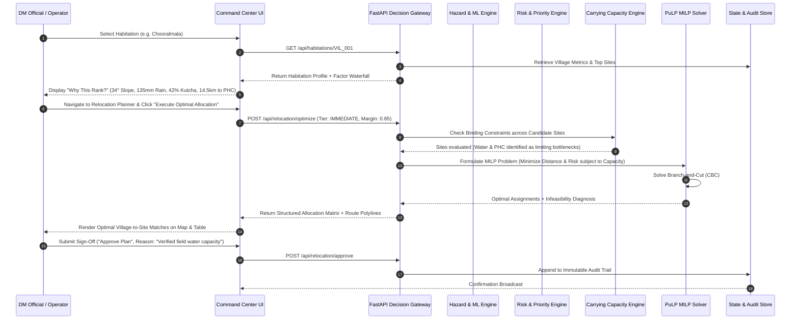

# AASHRAYA-GIS Technical Architecture & Data Flow Specification

**Project:** Intelligent Multi-Hazard Red-Zone, Carrying-Capacity & Relocation Decision-Support Platform  
**Problem Statement ID:** 26191  
**Authority:** NDRF (Disaster Management Division), Ministry of Home Affairs, Government of India  
**Target Region:** Wayanad District, Kerala (Western Ghats Mountainous Corridor)  

---

## 1. Architectural Topology

AASHRAYA-GIS is designed as a **Modular Decision-Support Monolith**, prioritizing zero external network dependencies during field emergencies or high-stakes judging presentations.

```mermaid
flowchart TB
    subgraph Client ["Command Center Presentation Layer (React 19 + TypeScript + Vite)"]
        UI_DASH["1. Command Center Dashboard (8 KPIs, Urgency Queue, Alert Stream)"]
        UI_MAP["2. Intelligent GIS Decision Map (Leaflet Vector/Polygon Layers)"]
        UI_DRAWER["3. Habitation Detail Drawer (Factor Waterfall, 'Why this rank?')"]
        UI_PLANNER["4. Relocation Planner (Candidate Sites, Binding Bottlenecks, MILP Solver)"]
        UI_ANALYTICS["5. Spatial Analytics (Recharts Headroom & Vulnerability Distributions)"]
        UI_SIM["6. Live Rainfall Injection Controller (Dynamic Telemetry Surge)"]
        UI_AUDIT["7. Human Authority Sign-Off & Audit Trail Modal"]
    end

    subgraph API ["REST Decision Gateway (FastAPI Python 3.14)"]
        RT_DASH["/api/dashboard"]
        RT_HAB["/api/habitations, /api/habitations/{id}"]
        RT_HAZ["/api/hazards/layers, /api/hazards/summary"]
        RT_REL["/api/relocation/sites, /api/relocation/optimize, /api/relocation/approve"]
        RT_SIM["/api/simulation/heavy-rainfall, /api/simulation/reset"]
        RT_ANL["/api/analytics"]
        RT_AUD["/api/audit/logs"]
    end

    subgraph Engines ["Analytical & Operations Research Core"]
        E_ML["Landslide Susceptibility Classifier (Scikit-Learn Random Forest 100-Trees)"]
        E_HYDRO["HAND Hydrological Flood Engine (Height Above Nearest Drainage)"]
        E_HAZ["Max-Rule-Plus-Residual Multi-Hazard Combiner (PRD §5)"]
        E_VULN["Census Demographic Vulnerability Engine (Census 2011 Proxies)"]
        E_RISK["Composite UNDRR Risk Engine (Risk = f(Hazard, Exposure, Vulnerability))"]
        E_CAP["5-Dimensional Carrying Capacity & Bottleneck Engine (PRD §9)"]
        E_MILP["PuLP Mixed-Integer Linear Programming Solver (PRD §10)"]
        E_SIM["Dynamic Recompute Pipeline & Alert Generation Engine"]
    end

    subgraph Store ["Persistent Spatial Seed & In-Memory State Manager"]
        D_VIL["data/habitations.json (24 Wayanad Villages with Census & DEM Metrics)"]
        D_SITE["data/candidate_sites.json (6 Safe Sites + 1 Hard-Excluded Hazard Buffer)"]
        D_POLY["data/hazard_zones.geojson (Landslide, Flood, Cloudburst Polygons)"]
        D_HIST["data/historical_disasters.json (2024, 2019, 2018 Event Catalog)"]
        D_STATE["In-Memory State Store (Active Overrides, Allocations, Audit Trail)"]
    end

    Client <-->|Asynchronous JSON / GeoJSON| API
    API --> Engines
    Engines <--> Store
```

---

## 2. Decision Pipeline & Data Flow

The platform executes a sequential, deterministic decision chain that transforms raw physical terrain and demographic inputs into auditable government relocation orders:

---

## 3. Mathematical Formulations

### 3.1 Landslide Susceptibility ML Model
Trained on physical terrain covariates derived from SRTM 30m DEM:
$$\mathbf{x} = [\text{slope\_deg}, \text{elevation\_m}, \text{twi}, \text{dist\_to\_road\_cut}, \text{dist\_to\_river}, \text{rainfall\_24h}]$$
$$P(\text{Landslide}) = \text{RandomForestClassifier}(\mathbf{x})$$
Feature importances are surfaced directly to provide factor-level explainability (e.g., Slope contributes 38%, Rainfall 26%, TWI 18%).

### 3.2 Hydrological Flood Hazard (HAND)
$$H_{\text{flood}} = \min\left(1.0, \frac{\text{Rainfall}_{24\text{h}}}{180.0} \times \left(0.50 e^{-\frac{\text{HAND}}{3.5}} + 0.30 \frac{\text{Rainfall}}{270} + 0.20 e^{-\frac{\text{Dist}_{\text{river}}}{400}}\right)\right)$$

### 3.3 Multi-Hazard Combination: Max-Rule-Plus-Residual
$$\text{MaxHazard} = \max(0.40 \cdot H_{\text{landslide}}, 0.35 \cdot H_{\text{flood}}, 0.25 \cdot H_{\text{cloudburst}})$$
$$\text{HazardIndex} = \min\left(1.0, \text{MaxHazard} + 0.15 \sum_{\text{other}} w_i H_i\right)$$

### 3.4 Composite Risk Index (UNDRR Standard)
$$\text{CompositeRisk} = 100 \times \left(0.40 \cdot \text{HazardIndex} + 0.25 \cdot \text{Exposure}_{\text{norm}} + 0.20 \cdot \text{VulnerabilityIndex} + 0.15 \cdot \text{History}_{\text{norm}}\right)$$

### 3.5 Carrying Capacity Bottleneck Formulation
$$\text{EffectiveCapacity} = \lfloor \min(\text{LandCap}, \text{WaterCap}, \text{PowerCap}, \text{HealthCap}, \text{SchoolCap}) \times 0.85 \rfloor$$
Where:
- $\text{LandCap} = \text{UsableArea}_{\text{ha}} \times 125 \text{ persons/ha}$ (URDPFI density norm)
- $\text{WaterCap} = \frac{\text{NetSupply}_{\text{LPD}}}{100 \text{ LPCD}}$ (Jal Jeevan Mission norm)
- $\text{PowerCap} = \frac{\text{SubstationHeadroom}_{\text{kW}}}{0.5 \text{ kW/hh}} \times 4.5 \text{ persons/hh}$
- $\text{HealthCap} = \text{PHCCapacity} - \text{Catchment}$ (IPHS norm)
- $\text{SchoolCap} = \text{ClassroomHeadroom} \times 40$ (RTE norm)

### 3.6 Relocation Optimization (PuLP MILP)
$$\min \sum_{(i, j) \in \text{Feasible}} \text{Cost}_{ij} \cdot x_{ij} + \sum_i 1000.0 \cdot u_i$$
Subject to:
1. Every village must either be assigned to exactly one feasible site or flagged as escalated via slack variable $u_i$:
   $$\sum_{j} x_{ij} + u_i = 1 \quad \forall i$$
2. Total assigned population cannot exceed available site capacity:
   $$\sum_i \text{Pop}_i \cdot x_{ij} \le \text{AvailableCapacity}_j \quad \forall j$$
3. Maximum operational distance: $d_{ij} \le 35\text{ km}$
4. Binary domain: $x_{ij} \in \{0, 1\}, \quad u_i \in \{0, 1\}$

---

## 4. Disaster Data Provenance

| Layer | Source | Spatial / Temporal Resolution | Access & Authentication |
|:---|:---|:---|:---|
| Habitations & Demographics | Census 2011 Primary Census Abstract / SHRUG | Village-level polygon/point | Open Government Data (data.gov.in) |
| Digital Elevation Model | SRTM 30m / CartoDEM | 1-arcsecond (~30m) | USGS EarthExplorer / OpenTopography |
| Landslide Susceptibility | NRSC Landslide Atlas of India & GSI Inventory | 1:25,000 spatial mapping | GSI Bhukosh / Bhuvan Geoportal |
| Extreme Rainfall Telemetry | IMD Gridded Rainfall Archives (IMDLIB) | 0.25° × 0.25° daily grid | IMD Pune Gridded Data Archive |
| Flood Discharge & HAND | Central Water Commission (CWC) / WRIS | Station telemetry / Hydrological Basin | India-WRIS Portal |
| Administrative Boundaries | Survey of India / Community Shapefiles | Taluk / Tehsil / Panchayat | OpenStreetMap / DataMeet India |
